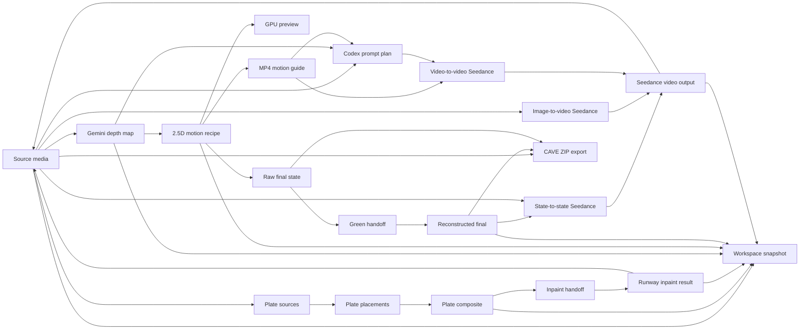

# Zenith Interface Rework Capability Spec

Status: draft for Svelte 5 reimplementation
Date: 2026-06-09

## 1. Thesis

Zenith is not a generic media editor. It is a fulldome artifact workbench: a place to move one dome image through spatial composition, repair, depth, 2.5D motion, video-model handoff, review, and export.

The current interface exposes this as a long vertical control rail. That hides the real structure of the system. The new interface should expose the pipeline as artifact lineage: what exists, where it came from, what can be done next, and what risks or projection assumptions are attached to it.

## 2. Evidence Boundary

Evidence labels:

- `confirmed`: directly observed in local code, tests, docs, or command output.
- `repo-inferred`: strongly implied by local code but not executed in this audit.
- `external-confirmed`: supported by current official documentation.
- `hypothesis`: proposed design or future extension.
- `unknown`: not determined from current code.

Repo boundary:

- `confirmed`: SvelteKit app mounted through `src/routes`.
- `confirmed`: SvelteKit server routes live under `src/routes/api`, with Runway/Codex implementation split under `src/lib/server/runway`.
- `confirmed`: Runway API proxy endpoints and Codex prompt-planning endpoints are server-side.
- `confirmed`: WebGPU/WebCodecs client paths exist for dome rendering, plate compositing, depth motion preview/export, and view capture.
- `confirmed`: IndexedDB/localStorage session persistence exists in `src/workspace`.
- `confirmed`: Svelte 5 and SvelteKit are installed.

Svelte 5 implementation facts:

- `external-confirmed`: Svelte uses a compiler for declarative components and can be used directly with Vite, while SvelteKit is the official app framework.
- `external-confirmed`: Svelte 5 runes support deep reactive `$state`, derived state with `$derived`, and effects with `$effect`.
- `external-confirmed`: Svelte docs caution that `$effect` should usually be an escape hatch, not a general state synchronization tool.

References:

- Svelte docs: https://svelte.dev/docs
- Svelte LLM plaintext docs: https://svelte.dev/docs/svelte/llms.txt
- Svelte 5 migration guide: https://svelte.dev/docs/svelte/v5-migration-guide

## 3. Current Execution Surfaces

### 3.1 Browser app

`confirmed`

Entry:

- `index.html`
- `src/main.ts`

Primary surfaces:

- main WebGPU viewer canvas: `#viewer`
- HUD canvas: `#hud`
- side control panel: `#sidePanel`
- video transport: `#videoSource`, timeline controls

Current workspace tabs:

- Create
- Review
- Ship
- global State and versions section

Issue:

- The workspace labels do not match actual capabilities. "Ship" contains depth generation, 2.5D motion, prompt planning, Seedance generation, CAVE export, capture, and demos.

### 3.2 Server API

`confirmed`

Runway:

- `GET /api/runway/status`
- `POST /api/runway/inpaint`
- `POST /api/runway/inpaint-stream`
- `POST /api/runway/depth-map-stream`
- `POST /api/runway/seedance-stream`
- `POST /api/runway/seedance-image-stream`

Codex:

- `POST /api/codex/seedance-prompt-stream`
- `POST /api/codex/seedance-image-prompt-stream`

Important constraints:

- Runway key stays server-side.
- JSON body limit is 128 MB.
- Seedance video input limit is 32 MB.
- Seedance prompt max is 3500 characters.
- Codex prompt planning runs read-only, network-disabled, against repo-local prompt packs.

### 3.3 Local browser capabilities

`confirmed`

- WebGPU rendering and compositing.
- WebCodecs/Mediabunny MP4 export where supported.
- IndexedDB workspace snapshots.
- local file input and browser download.
- canvas/image/video decoding through browser APIs.

Failure surfaces:

- missing Runway key
- missing WebGPU
- missing WebCodecs MP4 support
- stale operation result after source/plate/settings changes
- Seedance input too large
- IndexedDB unavailable
- video metadata/load failures

## 4. Domain Objects

### SourceMedia

`confirmed`

Owner modules:

- `src/media/media-controller.ts`
- `src/app/types.ts`

Shape:

- image or video
- name, width, height, duration, fps estimate
- image source canvas or video element texture

Lifecycle:

- default procedural map
- user upload
- Runway inpaint result
- Seedance result video
- temporary depth/final-state preview

UI need:

- always visible current source card
- clear distinction between source-of-truth and temporary preview
- ability to restore source after preview

### FulldomeProfile

`confirmed`

Owner modules:

- `src/geometry/source-projection.ts`
- `src/fulldome/profile.ts`
- `src/fulldome/qc.ts`

Shape:

- projection mode: zenith-180, zenith-230, nadir-180, cave-270
- equidistant fisheye mapping
- center: zenith or nadir
- FOV, theta range, horizon radius
- above/below-horizon band
- radius scale, tilt, audience/front rotation
- square master metadata

UI need:

- profile badge visible near every projection-sensitive operation
- QC warnings attached to motion and export artifacts

### PlateSource

`confirmed`

Owner modules:

- `src/plates/plate-controller.ts`
- `src/plates/plate-placement.ts`

Shape:

- name
- canvas
- width, height, aspect

Lifecycle:

- user loads one or more images
- images are downscaled to max side 2048
- default plate references can load on startup

UI need:

- plate tray with thumbnails
- selected plate inspector
- not just a file count readout

### PlatePlacement

`confirmed`

Owner modules:

- `src/plates/plate-placement.ts`
- `src/ui/pointer-tools.ts`
- `src/geometry/plate-screen-controls.ts`

Shape:

- azimuth
- radius
- scale
- spin
- opacity
- flipX, flipY
- corner offsets for warp

Lifecycle:

- auto-arranged
- edited through sliders or direct canvas handles
- compensated when projection center changes
- serialized in workspace snapshots and version snapshots

UI need:

- direct manipulation remains primary
- numeric inspector is secondary
- selected plate should be visible in lineage and viewport

### PlateComposite

`confirmed`

Owner modules:

- `src/plates/plate-gpu-compositor.ts`
- `src/plates/plate-controller.ts`
- `src/inpaint/inpaint-handoff.ts`

Shape:

- 2048 square canvas
- GPU texture preview
- dirty/committed flag

Artifacts:

- committed source image
- exported inpaint handoff PNG
- inpaint white/mask canvases

UI need:

- "plate sketch artifact" should be an actual node with dirty/clean state

### InpaintJob and RunwayImageOutput

`confirmed`

Owner modules:

- `src/inpaint/inpaint-controller.ts`
- `src/routes/api`
- `src/lib/server/runway/runway-jobs.ts`
- `src/runway/client.ts`

Models:

- `gpt_image_2` for inpaint/reconstruction

Inputs:

- plate handoff image
- projection-specific prompt
- quality

Outputs:

- one generated image result currently
- prompt, model, ratio, quality, createdAt metadata

UI need:

- show prompt alongside result
- show input handoff next to output
- "use result" should read as promoting an artifact to SourceMedia

### DepthMap

`confirmed`

Owner modules:

- `src/sketch/depth-motion-controller.ts`
- `src/routes/api`
- `src/lib/server/runway/runway-jobs.ts`

Model:

- `gemini_image3_pro`

Inputs:

- current source frame
- depth prompt
- ratio 2048:2048

Outputs:

- grayscale depth PNG/canvas
- model and prompt metadata

UI need:

- depth is a first-class artifact, not a hidden prerequisite
- show polarity, near/far interpretation, source prompt, and export action

### DepthMotionSettings

`confirmed`

Owner modules:

- `src/sketch/depth-parallax-renderer.ts`
- `src/sketch/depth-motion-presets.ts`
- `src/sketch/depth-motion-controller.ts`

Controls:

- depth polarity
- guide mode: source, depthShaded, depthMap
- size: 720, 1024, 1280, 1536
- near/far meters
- duration, FPS
- motion gain
- depth contrast
- guide noise
- yaw, pitch, roll
- truck, lift, push
- gap fill

UI need:

- this is a motion recipe, not a settings grid
- the recipe should show endpoint, comfort/QC status, and generated artifacts
- advanced knobs can be collapsed behind "motion recipe detail"

### 2.5D Motion Guide

`confirmed`

Owner modules:

- `src/sketch/depth-webgpu-renderer.ts`
- `src/sketch/depth-parallax-renderer.ts`
- `src/media/webcodecs-mp4.ts`

Capabilities:

- real-time WebGPU preview
- MP4 export through WebCodecs/Mediabunny
- source/depth/depth-shaded guide styles
- green-dome handoff background for final-state reconstruction

Artifacts:

- preview texture/canvas
- MP4 guide
- config JSON
- sampled guide frames for Codex prompt planning

UI need:

- preview and exported guide should be distinct artifacts
- final frame should be inspectable before reconstruction

### StateEndpoint

`confirmed`

Owner modules:

- `src/sketch/depth-motion-controller.ts`

Artifacts:

- raw final 2.5D state
- green handoff PNG
- reconstructed final state via `gpt_image_2`

Lifecycle:

- capture final
- export raw final
- export handoff
- reconstruct final
- use reconstructed final as last-frame reference for Seedance state-to-state

UI need:

- endpoint pair view: raw/handoff/reconstructed
- "first state" and "last state" should be visually explicit

### PromptPlan

`confirmed`

Owner modules:

- `src/routes/api`
- `src/lib/server/runway/codex-planner.ts`
- `src/lib/server/runway/runway-jobs.ts`
- `docs/seedance_prompt_pack`
- `docs/seedance_image_prompt_pack`

Prompt planning modes:

- depth motion guide repair: strict repair, conservative lock, more volumetric
- image/state video: ambient scene motion, scene event, material life

Outputs:

- diagnosis
- selected mode
- main prompt
- variants
- strategy
- warnings
- negative terms

UI need:

- prompt plan should be inspectable and editable before sending
- generated prompt freshness should be visible
- warnings from Codex and fulldome QC should sit together

### SeedanceVideoOutput

`confirmed`

Owner modules:

- `src/sketch/depth-motion-controller.ts`
- `src/routes/api`
- `src/lib/server/runway/runway-jobs.ts`

Workflows:

- depth-motion-reference video-to-video with still reference
- first/last image state-to-state
- image-to-video from source still

Inputs:

- source image
- optional final image
- optional depth MP4 guide
- prompt
- ratio
- duration

Outputs:

- MP4 data URI or URL
- model
- prompt
- workflow
- duration

UI need:

- videos should live in a result shelf attached to their recipe
- "show video" promotes video to current source, but should keep provenance

### CAVEExport

`confirmed`

Owner modules:

- `src/capture/cave-export-controller.ts`
- `src/export/cave-exporter.ts`

Inputs:

- current source, reconstructed final, or raw final
- projection preset
- face size
- room profile
- source transform: rotation, tilt, mirror

Outputs:

- ZIP of face PNGs
- manifest JSON with coverage ratios

UI need:

- CAVE remap belongs in export/delivery lane, not hidden among generation controls
- coverage should be visible before/after export

### Removed Legacy Session/Version Path

`removed`

Removed modules:

- `src/workspace/session-repository.ts`
- `src/workspace/workspace-snapshot.ts`
- `src/workspace/version-controller.ts`

Removed capabilities:

- autosave to IndexedDB
- switch sessions
- create named sessions
- startup default
- export/import workspace JSON
- save/apply/delete/export versions

Replacement direction:

- artifact URLs/blobs, operator configs, prompts, projection profiles, and QC should live on DAG nodes
- recovery/persistence should be rebuilt from artifact records, not from opaque session snapshots

## 5. Artifact Graph



## 6. Capability Cards

### Load and promote source media

Evidence: `confirmed`

Inputs:

- image file
- video file
- default map
- generated image result
- generated video result

Outputs:

- current source texture
- source canvas for stills
- video transport state for videos

Parameters:

- playback rate for videos

Constraints:

- changing source clears depth state
- video frames are sampled from current paused/loaded video when needed

Interface affordance:

- source artifact card with "promoted from" provenance

### Compose plate sketch

Evidence: `confirmed`

Inputs:

- image plate files
- projection mode
- placement controls

Outputs:

- dirty preview texture
- committed 2048 square plate composite
- inpaint handoff PNG

Parameters:

- count
- fit
- edge fade
- active plate
- azimuth, radius, spin, opacity
- corner warp
- flip horizontal/vertical

Constraints:

- current implementation auto-commits after plate load when enough plates exist
- edit mode and commit state are easy to lose in the current UI

Interface affordance:

- viewport direct manipulation plus selected plate inspector
- explicit "commit sketch" artifact transition

### Inpaint plate sketch

Evidence: `confirmed`

Inputs:

- inpaint handoff canvas
- projection-specific prompt
- quality

Outputs:

- Runway image outputs
- promoted source image
- exported PNG

Parameters:

- prompt
- quality

Constraints:

- currently one output is forced
- Runway key required

Interface affordance:

- side-by-side handoff/output review
- prompt dock attached to job

### Review projection

Evidence: `confirmed`

Inputs:

- current source media
- projection profile
- camera controls
- overlays

Views:

- center/inside
- theater
- orbit
- flat
- split
- CAVE

Parameters:

- FOV
- render scale
- mesh quality
- map radius
- azimuth
- dome tilt
- theater eye drop/seat back/pitch
- shell/floor/exposure/overlay
- mirror and overlay toggles

Interface affordance:

- primary viewport with mode strip
- compact camera/profile inspector
- preset view buttons

### Generate depth map

Evidence: `confirmed`

Inputs:

- current source frame
- depth prompt

Outputs:

- depth map canvas
- model/prompt metadata
- exported depth PNG

Constraints:

- Runway key required
- depth map invalidates final state when changed

Interface affordance:

- depth artifact node with prompt, polarity, near/far interpretation, export

### Build 2.5D motion guide

Evidence: `confirmed`

Inputs:

- source frame
- depth map
- depth motion settings
- fulldome profile

Outputs:

- WebGPU preview
- MP4 guide
- depth motion config JSON
- sampled guide frames for Codex
- raw final state
- green handoff PNG

Parameters:

- preset
- guide look
- size
- duration/FPS
- depth range/polarity/contrast/noise
- yaw/pitch/roll
- truck/lift/push
- gap fill

Constraints:

- WebGPU required for renderer
- WebCodecs MP4 required for MP4 export
- Seedance guide max 32 MB
- QC warnings now available from `src/fulldome/qc.ts`

Interface affordance:

- motion recipe strip with endpoint preview
- QC badge
- "render preview", "export MP4", "capture endpoint" actions

### Reconstruct final state

Evidence: `confirmed`

Inputs:

- 2.5D green handoff
- original/source image as style/material reference
- reconstruction prompt

Outputs:

- reconstructed final state PNG/canvas
- endpoint artifact for Seedance state-to-state

Constraints:

- prompt is not visible in current UI
- operation fingerprint clears stale results

Interface affordance:

- endpoint comparison viewer: source, raw final, handoff, reconstructed final
- prompt should be visible and editable

### Plan Seedance prompt

Evidence: `confirmed`

Inputs:

- source image
- depth map
- sampled motion frames
- optional final image
- prompt pack context
- current prompt
- prompt mode
- projection/QC metadata

Outputs:

- diagnosis
- selected mode
- prompt
- variants
- negative terms
- warnings

Constraints:

- Codex runs server-side in read-only sandbox
- no network access in prompt planning
- prompt packs are repo-local

Interface affordance:

- prompt workbench with variants, warnings, and copy/edit/send actions

### Generate Seedance video

Evidence: `confirmed`

Inputs:

- source image
- prompt
- optional MP4 motion guide
- optional final image
- ratio
- duration

Outputs:

- Seedance MP4 outputs
- active output preview
- export video
- promote video to current source

Workflows:

- depth guide video-to-video
- first/last image-to-video
- still image-to-video

Interface affordance:

- result shelf grouped by workflow recipe
- provenance retained when video is promoted

### Export CAVE faces

Evidence: `confirmed`

Inputs:

- source/current/final canvas
- projection preset
- face size
- room model
- source orientation

Outputs:

- ZIP with face PNGs
- manifest JSON
- coverage summary

Interface affordance:

- delivery/export lane with coverage report

### Persist workspace and versions

Evidence: `confirmed`

Inputs:

- current state, controls, canvases, generated outputs, plate placements

Outputs:

- IndexedDB snapshots
- session list
- startup default
- portable JSON export
- version gallery

Interface affordance:

- top-level project bar
- version timeline, not buried after generation controls

## 7. Current Interface Problems

`confirmed`

1. `index.html` hardcodes all panels and controls. The DOM is the state contract.
2. `src/ui/dom.ts` queries a very large object of elements; missing elements crash startup.
3. `src/ui/events.ts` binds almost all behavior centrally.
4. `src/main.ts` composes controllers and is also workflow coordinator, snapshot coordinator, event action provider, projection prompt updater, and global UI updater.
5. Controller closures keep local operation state, while app state lives in a mutable plain object.
6. Derived readiness is reimplemented in multiple update functions.
7. The UI is operation-first, not artifact-first.
8. Prompt visibility is inconsistent.
9. Projection profile, QC, source provenance, and artifact freshness are not structurally central.
10. Result strips are visually small compared with the importance of generated artifacts.

## 8. New Instrument Brief

### Instrument name

Fulldome Lineage Bench

### Primary research act

Move a domemaster artifact through spatial repair, depth, motion, and video generation while preserving projection assumptions and provenance.

### Central surface

Artifact lineage board.

This should not be a generic node graph. It is a staged board where each artifact has:

- source thumbnail/preview
- provenance
- readiness
- QC status
- available next transitions
- attached prompt/recipe
- export/promote actions

### Interaction grammar

Objects:

- source
- plate
- placement
- sketch
- handoff
- inpaint result
- depth map
- motion recipe
- motion guide
- endpoint
- prompt plan
- Seedance video
- CAVE export
- workspace snapshot

Gestures:

- load
- select
- promote
- compare
- inspect
- edit recipe
- render preview
- generate
- reconstruct
- export
- fork version
- restore

Feedback:

- live dome viewport
- thumbnail
- prompt freshness
- QC badge
- operation progress
- stale-state warning
- artifact provenance
- export manifest/status

### Screen states

Empty:

- default procedural source loaded
- board shows source node and possible first actions

Plate composition:

- plate tray visible
- viewport direct manipulation active
- selected placement inspector open
- sketch node dirty/clean state visible

Inpaint running:

- handoff node locked
- progress on inpaint job
- previous source remains visible

Depth ready:

- depth node visible
- motion recipe enabled
- depth prompt and metadata inspectable

Motion preview:

- viewport can switch to GPU preview without losing source identity
- motion QC visible

Endpoint reconstruction:

- source, raw endpoint, handoff, reconstructed endpoint comparison visible

Seedance planning:

- prompt variants visible
- selected prompt is editable
- warnings visible

Seedance result:

- video shelf visible
- promote/export actions visible
- provenance retained

Export/delivery:

- CAVE and capture outputs grouped with manifests/settings

Failure:

- error belongs to the artifact/job that failed
- stale operation result should not mutate current artifact

## 9. Svelte 5 Reimplementation Strategy

### Framework choice

Use SvelteKit as the app framework, with SvelteKit server routes owning Runway/Codex integration.

Reason:

- the app now needs first-class server endpoints for Runway/Codex proxying and streaming
- SvelteKit keeps page routing, API routing, builds, and preview behind one framework boundary
- `src/lib/server` keeps API secrets and local prompt-pack reads out of browser bundles

Route-level loading and server actions can be added as artifact persistence and shareable project flows mature.

### State model

Use Svelte 5 runes for UI/application state:

```ts
export class ZenithStore {
  source = $state<SourceArtifact>(createDefaultSourceArtifact());
  plates = $state<PlateArtifact[]>([]);
  sketch = $state<SketchArtifact | null>(null);
  inpaint = $state<InpaintLane>(createInpaintLane());
  depth = $state<DepthLane>(createDepthLane());
  motion = $state<MotionLane>(createMotionLane());
  seedance = $state<SeedanceLane>(createSeedanceLane());
  workspace = $state<WorkspaceLane>(createWorkspaceLane());

  readiness = $derived.by(() => computeReadiness(this));
  currentProfile = $derived.by(() => buildFulldomeProfileFromStore(this));
  motionQc = $derived.by(() => analyzeMotionQcFromStore(this));
}
```

Rules:

- Use `$state` for mutable artifact state.
- Use `$derived` for readiness, profile labels, artifact freshness, and capability availability.
- Use `$effect` only for imperative boundaries: renderer lifecycle, video frame loop, autosave scheduling, browser event registration.
- Do not use `$effect` to synchronize two pieces of app state when an action handler or derived value is clearer.
- Use `$state.raw` or non-reactive fields for large binary/canvas/GPU resources when deep proxying is not useful.

### Keep vs rewrite

Keep:

- projection math
- fisheye/cave geometry
- WebGPU shader/rendering code initially
- Runway client and server endpoints
- prompt packs
- WebCodecs MP4 helpers
- workspace serialization concepts
- fulldome profile/QC module

Rewrite:

- `index.html` panel markup
- `src/ui/dom.ts`
- `src/ui/events.ts`
- DOM-heavy controller UI methods
- global `main.ts` coordinator
- result rendering and prompt preview rendering

Adapt:

- current controllers should become command services with explicit inputs/outputs
- renderer should become an imperative Svelte adapter
- operation manager should become a job/run queue store

## 10. Proposed Svelte File Structure

```text
src/
  main.ts
  App.svelte
  lib/
    state/
      zenith-store.svelte.ts
      artifact-types.ts
      readiness.ts
      operations.svelte.ts
    services/
      media-service.ts
      plate-service.ts
      inpaint-service.ts
      depth-service.ts
      seedance-service.ts
      workspace-service.ts
      export-service.ts
    components/
      shell/
        AppShell.svelte
        ProjectBar.svelte
        WorkflowRail.svelte
      viewport/
        DomeViewport.svelte
        HudCanvas.svelte
        ViewModeStrip.svelte
      lineage/
        ArtifactBoard.svelte
        ArtifactCard.svelte
        ArtifactCompare.svelte
        ProvenanceTrail.svelte
      inspector/
        InspectorPanel.svelte
        SourceInspector.svelte
        PlateInspector.svelte
        MotionRecipeInspector.svelte
        PromptInspector.svelte
        ExportInspector.svelte
      jobs/
        JobQueue.svelte
        ProgressButton.svelte
      results/
        ResultShelf.svelte
        VideoResultCard.svelte
        ImageResultCard.svelte
```

Existing domain folders such as `src/geometry`, `src/graphics`, `src/plates`, `src/sketch`, `src/media`, `src/runway`, and `src/workspace` should be kept initially and imported by the new services.

## 11. Target Layout

Primary viewport:

- large central/right dome viewport
- always available mode strip: Dome, Flat, Split, CAVE, Endpoint Compare

Left rail:

- artifact lineage board
- compact pipeline nodes, not settings forms
- source -> sketch -> inpaint -> depth -> motion -> endpoint -> video/export

Right inspector:

- only the selected artifact/recipe controls
- one focused action group at a time
- prompts visible where prompts matter

Bottom strip:

- job queue
- media transport when current source is video
- result shelf for current selected lane

Top bar:

- projection profile
- session/version
- Runway status
- autosave state
- export/import project

## 12. Component Responsibilities

### AppShell

Owns layout only. No pipeline logic.

### ZenithStore

Owns reactive state and derived readiness. No DOM access.

### DomeViewport

Owns canvas refs and renderer lifecycle. Receives state snapshots and command callbacks.

### ArtifactBoard

Shows lineage, readiness, stale flags, and available transitions.

### InspectorPanel

Switches by selected artifact type. It should not know how to run API calls directly.

### Services

Own imperative commands:

- `loadSource`
- `commitPlateSketch`
- `runInpaint`
- `generateDepth`
- `renderMotionPreview`
- `exportMotionGuide`
- `captureEndpoint`
- `reconstructEndpoint`
- `planPrompt`
- `generateSeedance`
- `exportCaveFaces`
- `saveWorkspace`

Each service command should return either:

- a new artifact
- an artifact patch
- a job record
- an exported blob

## 13. Acceptance Tests for the Rewrite

P0 acceptance:

- app boots with default source
- projection mode can switch between all five modes
- viewport renders source
- source image upload works
- existing default plate references can load
- plate sketch can be committed
- inpaint prompt is visible and projection-specific
- workspace autosave still restores source, controls, plates, outputs
- no Runway key state is handled without crashing

P1 acceptance:

- inpaint run works through existing server endpoint
- generated image can be promoted to source
- depth generation works
- depth motion preview works
- depth motion MP4 export works
- motion config export contains fulldome profile and QC
- endpoint capture/reconstruction artifacts are visible

P2 acceptance:

- Codex prompt planning works for motion guide and state/image workflows
- Seedance generation works in all three workflows
- generated videos appear in result shelf and can be promoted/exported
- CAVE ZIP export works and shows coverage

P3 acceptance:

- keyboard shortcuts for view/transport remain
- demo capture tools still work or are intentionally removed
- browser screenshot confirms no text overflow/overlap at desktop and mobile sizes

## 14. Migration Plan

### Phase 0: Contract freeze

Deliverables:

- this spec
- artifact type definitions
- command signatures
- renderer adapter boundary

No visual redesign implementation yet.

### Phase 1: Svelte boot shell

Deliverables:

- install Svelte 5 and Vite plugin
- replace `index.html` app body with Svelte mount target
- create `App.svelte`
- render default source and existing WebGPU viewer through an adapter
- keep current server

Risk:

- renderer currently expects `ZenithDom` shape; adapter must decouple it.

### Phase 2: Source and review lanes

Deliverables:

- source upload
- projection selector
- view mode strip
- media transport
- top profile/QC/status bar

### Phase 3: Plate and inpaint lanes

Deliverables:

- plate tray
- direct placement edit
- committed sketch artifact
- inpaint handoff preview
- Runway inpaint result shelf

### Phase 4: Depth and motion lanes

Deliverables:

- depth artifact
- motion recipe inspector
- WebGPU preview
- MP4 export
- config/prompt export
- final endpoint capture/handoff/reconstruction

### Phase 5: Prompt and video lanes

Deliverables:

- prompt workbench
- Codex planning
- Seedance generation
- video result shelf

### Phase 6: Delivery and persistence

Deliverables:

- workspace/session/version interface
- CAVE export
- capture/export panel
- import/export full state

## 15. Explicit Non-goals for the First Rewrite

- Do not redesign projection math.
- Do not replace WebGPU renderer.
- Do not replace Runway/Codex server routes.
- Do not add DINOv2 or dual RGBD bridge during UI migration.
- Do not invent a node graph unless graph semantics become real.
- Do not hide prompts.
- Do not make the first screen a marketing/landing page.
- Do not use cards as decoration; use artifact cards only when they represent actual artifacts.

## 16. Open Questions

1. Should the Svelte rewrite be a hard cut or run in parallel under a feature flag/path?
2. Should existing workspace snapshots be migrated automatically, or can old sessions be treated as legacy imports?
3. Should prompt plans become persisted first-class artifacts in workspace snapshots?
4. Should the current hidden Codex plan buttons become visible now that the prompt workbench would own them?
5. Should capture/demo tooling survive in the production interface, or move to a developer/debug drawer?
6. Should CAVE room dimensions become user-editable profiles before or after Svelte migration?

## 17. Recommendation

Start with a parallel Svelte shell while keeping the current TypeScript domain modules and server. The first milestone should not be "all current controls ported." It should be:

1. artifact board exists
2. viewport renders
3. source/projection/review are functional
4. state is centralized in Svelte runes
5. operations are command services with explicit artifact outputs

Only after that should plate, inpaint, depth, Seedance, and export lanes be migrated one at a time.
