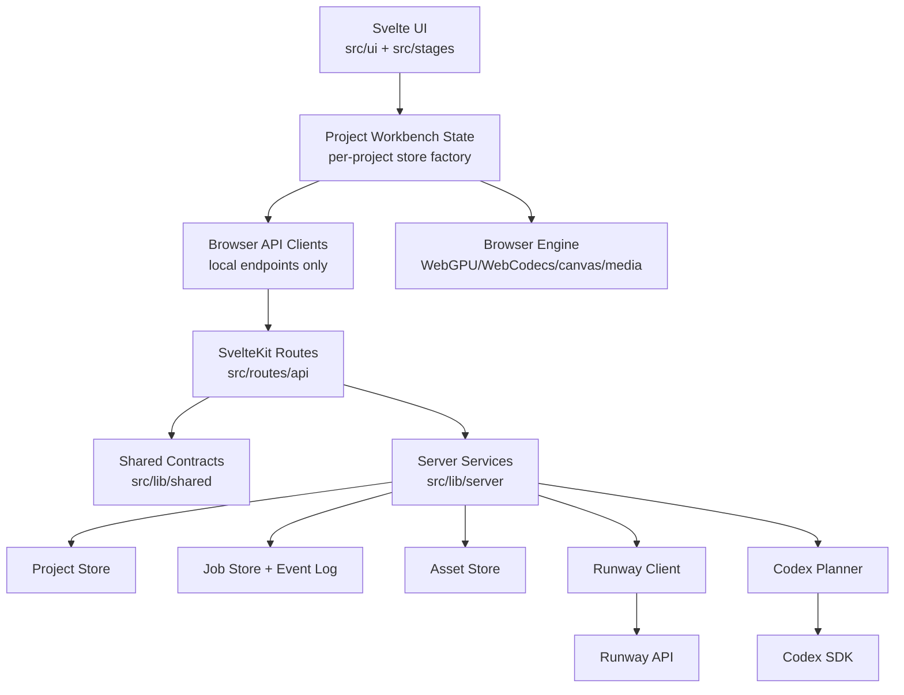

# Zenith Ultimate Architecture Roadmap

This document describes the most ideal long-term architecture for Zenith and a practical migration path from the current repo. It is intentionally more ambitious than the current SvelteKit architecture note.

The current architecture is good for a local/single-user fulldome production cockpit. The ultimate architecture should support durable projects, durable media artifacts, resumable paid jobs, clearer ownership, safer API contracts, and production operations without losing the fast browser-side WebGPU/WebCodecs workflow that makes Zenith useful.

## Brutally Honest Assessment

What is already right:

- SvelteKit owns routing, SSR, endpoint routes, production build output, and adapter-node deployment.
- Server-only Runway/Codex code lives under `src/lib/server`.
- Browser code calls local SvelteKit endpoints instead of upstream paid APIs.
- WebGPU, WebCodecs, canvas, DOM, and media workflows are kept on the browser side.
- Zod is used at external request boundaries.
- NDJSON streaming is the right primitive for long-running progress feedback.
- The artifact-first workflow is a strong product model for fulldome production.

What is not ideal yet:

- Project/workbench state is mostly module-level browser state. That is fine for one open cockpit, but weak for saved projects, multiple tabs, collaboration, resumable jobs, and cloud deployment.
- Paid Runway/Codex operations are still shaped as request/response streams. That is usable, but not enough for production media jobs that should be durable, cancellable, retryable, inspectable, and recoverable after refresh.
- Artifact media is still often represented by object URLs, data URLs, blobs, canvases, and saved JSON snapshots. That works locally, but data URLs should not be the long-term artifact storage model.
- `workbench-commands.ts` owns too many responsibilities: project import/export, local media operators, paid API operators, artifact mutation, and browser file IO.
- Some UI components still contain too much orchestration logic. Large Svelte components should become thinner shells around tested domain modules.
- There is no first-class API contract layer shared between browser and server.
- There is no server-wide request context: request IDs, structured logging, security headers, auth/session context, or rate limits.

## Product Architecture Goal

Zenith should become a project-based fulldome media production system:

- A **Project** owns production intent, projection profile, prompts, settings, artifact graph, QC state, and selected outputs.
- An **Artifact** is a typed production object such as Plate Sketch, Start State, Start Depth, Motion Draft, End State, Video Take, or Deliverables.
- An **Asset** is the stored binary media behind an artifact: image, video, depth map, manifest, prompt pack output, or exported config.
- An **Operator** is a local or paid action that transforms input artifacts into output artifacts.
- A **Job** is a durable execution of an operator with status, progress events, inputs, outputs, cost/risk metadata, cancellation, and errors.
- A **Snapshot** is a portable project export, not the primary runtime storage model.

The browser should remain the high-performance interactive workstation. The server should own trust boundaries, secrets, paid upstream effects, persistent metadata, durable job state, and asset storage.

## End-State Shape



## Target Module Ownership

### `src/routes`

Owns SvelteKit page and endpoint routing only.

Allowed:

- Parse route params.
- Call shared request helpers.
- Call server services.
- Return JSON, NDJSON, SSE, or file responses.

Not allowed:

- Runway orchestration.
- Codex planning.
- Browser API usage.
- Large validation logic.
- Project or artifact mutation logic.

### `src/lib/shared`

Shared browser/server contracts with no side effects.

Suggested modules:

- `src/lib/shared/contracts/artifacts.ts`
- `src/lib/shared/contracts/projects.ts`
- `src/lib/shared/contracts/jobs.ts`
- `src/lib/shared/contracts/events.ts`
- `src/lib/shared/contracts/errors.ts`
- `src/lib/shared/ids.ts`

Allowed:

- TypeScript types.
- Zod schemas at API/storage boundaries.
- JSON-serializable domain types.
- Helpers for IDs, statuses, progress normalization, and contract-safe errors.

Not allowed:

- DOM, canvas, WebGPU, WebCodecs, localStorage, IndexedDB.
- Private environment access.
- Node filesystem access.
- Network calls.

### `src/lib/server`

Server-only trust boundary.

Suggested modules:

- `src/lib/server/env`: private environment reads and deployment defaults.
- `src/lib/server/http`: route helpers, request IDs, body limits, error formatting.
- `src/lib/server/projects`: project metadata persistence.
- `src/lib/server/assets`: asset storage, content hashing, signed/local URLs.
- `src/lib/server/jobs`: job creation, event log, cancellation, retries, status reads.
- `src/lib/server/operators`: server-side operator execution adapters.
- `src/lib/server/runway`: upstream Runway client and Runway-specific orchestration.
- `src/lib/server/codex`: Codex prompt planning and prompt-pack reads.

Allowed:

- Secrets.
- Paid API calls.
- Filesystem.
- Database/object storage.
- Durable job metadata.
- Request logging and security headers.

Not allowed:

- Browser-only APIs.
- UI state.
- Canvas/WebGPU/WebCodecs execution.

### `src/app` or `src/workbench`

Client-side project/workbench state and commands.

Ideal changes:

- Replace singleton global stores with a store factory such as `createWorkbenchStore(projectId)`.
- Split broad command modules by responsibility:
  - `project-import-export.ts`
  - `artifact-commands.ts`
  - `local-render-operators.ts`
  - `paid-job-operators.ts`
  - `media-import.ts`
- Keep commands explicit and product-shaped. Avoid generic command frameworks unless there is real repeated complexity.

### `src/engine`

Optional future name for browser execution logic that is not UI.

Current modules under `src/graphics`, `src/media`, `src/sketch`, `src/plates`, `src/scene`, `src/geometry`, and `src/fulldome` can stay where they are, but the ownership should be clearer:

- Pure math and projection logic stays testable and DOM-free where possible.
- WebGPU/WebCodecs/canvas modules stay browser-only and are never imported by server modules.
- UI components call engine modules through small orchestration functions.
- Capability detection is explicit and user-facing errors are clear.

### `src/ui` and `src/stages`

Svelte components should render state and collect user intent. They should not be the primary owner of business rules, job orchestration, or artifact persistence.

Good Svelte component responsibilities:

- Layout.
- Form controls.
- Canvas mounting.
- Pointer and keyboard interactions.
- Calling focused commands.
- Displaying job/artifact/QC state.

Poor Svelte component responsibilities:

- Building server payloads directly.
- Managing paid API lifecycle directly.
- Serializing projects.
- Mutating many artifact graph nodes inline.
- Owning complex projection/rendering math.

## Domain Model

### Project

A project is the durable root.

Minimum fields:

```ts
type Project = {
  id: string;
  title: string;
  createdAt: string;
  updatedAt: string;
  projectionProfile: SourceProjectionMode;
  artifactGraph: ArtifactGraphSnapshot;
  promptDrafts: PromptDrafts;
  motionConfig: DepthMotionConfig;
  qc: QcState;
};
```

### Artifact

Artifacts should store metadata and references to assets, not large binary payloads.

```ts
type Artifact = {
  id: ArtifactSlotId;
  projectId: string;
  stage: WorkflowStageId;
  status: ArtifactStatus;
  inputs: ArtifactSlotId[];
  selectedResultId?: string;
  results: ArtifactResult[];
  warnings: string[];
  stale: boolean;
  updatedAt: string;
};
```

### Asset

Assets are binary media objects.

```ts
type Asset = {
  id: string;
  projectId: string;
  kind: "image" | "video" | "json" | "depth" | "other";
  mime: string;
  byteLength: number;
  sha256: string;
  storageKey: string;
  width?: number;
  height?: number;
  durationSeconds?: number;
  createdAt: string;
};
```

Data URLs are acceptable as short-lived transport for small browser-generated artifacts. They should not be the durable project model.

### Operator

Operators describe capability and input/output roles.

Operator definitions are already a useful direction. The ideal version should separate:

- static operator metadata;
- availability checks;
- browser-local execution;
- server-paid execution;
- result application.

### Job

Jobs should become first-class.

```ts
type Job = {
  id: string;
  projectId: string;
  operatorId: OperatorId;
  status: "queued" | "running" | "succeeded" | "failed" | "cancelled";
  progress: number;
  stage: string;
  inputArtifactIds: ArtifactSlotId[];
  outputArtifactIds: ArtifactSlotId[];
  createdAt: string;
  startedAt?: string;
  finishedAt?: string;
  error?: PublicApiError;
};
```

Job events should be append-only:

```ts
type JobEvent =
  | { type: "progress"; jobId: string; stage: string; progress: number; createdAt: string }
  | { type: "artifact"; jobId: string; artifactId: ArtifactSlotId; assetId: string; createdAt: string }
  | { type: "error"; jobId: string; error: PublicApiError; createdAt: string }
  | { type: "complete"; jobId: string; result: unknown; createdAt: string };
```

## API Target

The current streaming endpoints can remain while the job system is introduced. The ideal API is job-oriented.

### Status

- `GET /api/status`
- `GET /api/runway/status`

### Projects

- `POST /api/projects`
- `GET /api/projects/:projectId`
- `PATCH /api/projects/:projectId`
- `GET /api/projects/:projectId/snapshot`
- `POST /api/projects/import`

### Assets

- `POST /api/projects/:projectId/assets`
- `GET /api/assets/:assetId`
- `GET /api/assets/:assetId/download`

Initial implementation can store files locally under a server data directory. Later it can move to object storage without changing artifact contracts.

### Jobs

- `POST /api/projects/:projectId/jobs`
- `GET /api/jobs/:jobId`
- `GET /api/jobs/:jobId/events`
- `DELETE /api/jobs/:jobId`

`GET /api/jobs/:jobId/events` may use NDJSON or SSE. NDJSON is already in the app and is fine. SSE becomes attractive if the event stream becomes long-lived and mostly server-to-browser.

### Compatibility Layer

Current endpoints such as `/api/runway/inpaint-stream` can become adapters:

1. Validate payload.
2. Create an internal job.
3. Subscribe to job events.
4. Stream progress until complete.

That preserves current browser workflows while the internals become durable.

## Job Execution Strategy

Do not jump straight to a heavy queue unless deployment needs it.

### Phase A: In-Memory Job Store

Useful for local development and the first architecture step.

- Jobs live in memory.
- Events live in memory.
- Cancellation uses `AbortController`.
- Current streamed routes are backed by the job store.
- Tests can assert job lifecycle without paid calls.

Limitations:

- Jobs disappear on server restart.
- Not multi-process safe.
- Not enough for cloud production.

### Phase B: Persisted Job Store

Use SQLite for local/single-node deployment or Postgres for hosted/multi-user deployment.

- Jobs survive refresh and restart.
- Event logs are queryable.
- Failed jobs can be inspected.
- Cancelled jobs remain visible.
- Idempotency keys can prevent duplicate paid calls.

### Phase C: Worker Separation

Only when production deployment needs it.

- SvelteKit handles HTTP/UI.
- A worker process executes jobs.
- Job queue could be database-backed or use a queue service.
- Paid upstream calls are isolated from HTTP request lifetime.

Do not add this too early. Worker separation adds operational weight and should be justified by real production constraints.

## Asset Storage Strategy

Ideal durable storage:

- Metadata in a project/job/artifact store.
- Binary assets in object storage or a local content-addressed asset directory.
- `sha256` or equivalent content hash for de-duplication and integrity.
- Signed or scoped asset URLs when auth exists.
- Browser object URLs only for local previews.
- Data URLs only for transient payloads and portable export snapshots.

Recommended migration:

1. Add `AssetRef` to artifact results while keeping current `media.url`.
2. Teach project export/import to preserve asset refs and optionally embed small assets.
3. Move generated server outputs into an asset store.
4. Move large browser-generated outputs into asset uploads instead of JSON snapshots.

## Validation Strategy

Use Zod at external boundaries:

- Browser-to-server API requests.
- Project import files.
- Stored snapshot format.
- Job creation payloads.
- Asset metadata.
- Upstream response normalization when the shape is untrusted.

Do not use Zod everywhere:

- Pure geometry internals.
- Tight render loops.
- Every internal function call.
- Data already narrowed by typed modules.

The ideal shared contract modules should export both types and schemas where the boundary requires runtime validation.

## Error, Abort, And Observability

The ultimate architecture should add a thin `hooks.server.ts`.

Responsibilities:

- Create request IDs.
- Add `X-Content-Type-Options`, `Referrer-Policy`, and carefully chosen cross-origin headers.
- Log method, path, status, duration, and request ID.
- Store request ID in `event.locals`.
- Normalize uncaught server errors.

Do not put business logic in hooks.

Error model:

- Public errors are JSON-serializable and safe to show.
- Internal errors keep stack traces in logs.
- Upstream errors are normalized with status, provider, task/job ID, and public message.
- Abort/cancel uses a consistent status such as `499`.

## Testing Strategy

Keep three layers.

### Unit Tests

Use Vitest for:

- geometry/projection math;
- media helpers;
- artifact graph logic;
- job store lifecycle;
- route helper parsing/streaming;
- project import/export;
- operator availability and result application.

### API Contract Tests

Use Vitest or Playwright request tests for:

- invalid payloads rejected before paid work;
- malformed JSON;
- body size limits;
- job creation/status/cancel/event-stream behavior;
- asset upload metadata;
- auth/session behavior when added.

### Playwright Smoke Tests

Use Playwright for:

- SSR shell loads;
- the workbench hydrates;
- local API status contract;
- one or two critical no-paid-call API validation paths;
- basic project save/load/import flow when project persistence is added.

Avoid brittle UI scripting. Do not automate expensive media workflows or paid upstream calls in CI.

## Migration Roadmap

### Phase 0: Stabilize Current SvelteKit Boundary

Status: mostly done.

Goals:

- Keep API routes thin.
- Keep secrets server-only.
- Validate request bodies before paid work.
- Stream progress reliably.
- Propagate abort/cancel.
- Document actual architecture.

### Phase 1: Shared Contracts And Project Boundary

Highest-value next phase.

Deliverables:

- Add `src/lib/shared/contracts`.
- Move artifact/project/job API types into JSON-safe shared contracts.
- Extract project snapshot import/export out of `workbench-commands.ts`.
- Add project import/export tests around schema migration and invalid files.
- Keep runtime behavior mostly unchanged.

Why this comes first:

- It reduces ambiguity before adding jobs or storage.
- It makes future API changes safer.
- It creates a clean line between browser runtime objects and portable project data.

### Phase 2: Command Split And Thin UI

Deliverables:

- Split `workbench-commands.ts` by responsibility.
- Move paid API payload creation into focused operator modules.
- Move local render operator orchestration into focused modules.
- Keep Svelte components calling commands, not assembling complex payloads.
- Add unit tests around operator result application.

Why this matters:

- It lowers the risk of modifying production workflows.
- It prepares operators to become job-backed.
- It makes large UI components easier to simplify later.

### Phase 3: First-Class In-Memory Jobs

Deliverables:

- Add a server-side job store interface.
- Add job event types.
- Add `POST /api/projects/:projectId/jobs` and `GET /api/jobs/:jobId/events`.
- Back one paid path with jobs first, probably Start State repair or depth generation.
- Keep existing stream endpoint as a compatibility wrapper.
- Add no-paid-call tests for job create/cancel/events.

Why this matters:

- It makes paid work explicit.
- It creates the shape needed for resumability.
- It lets the UI reason about operations as durable units.

### Phase 4: Asset Abstraction

Deliverables:

- Add `AssetRef` and `Asset` metadata contracts.
- Add local server asset store for generated outputs.
- Convert server-generated Runway outputs from data URI results to stored assets plus preview URLs.
- Keep browser compatibility by resolving assets to usable URLs.
- Update project export to reference assets and optionally embed small assets.

Why this matters:

- It prevents project JSON from becoming the real database.
- It makes large media workflows more robust.
- It prepares for object storage.

### Phase 5: Persisted Projects And Jobs

Deliverables:

- Choose SQLite for local single-node or Postgres for hosted deployment.
- Persist projects, artifacts, jobs, job events, and asset metadata.
- Add migrations.
- Add project list/open/recent flows.
- Make job status survive page refresh and server restart.

Why this matters:

- This is the step where Zenith becomes production software instead of only a local session tool.

### Phase 6: Production Operations

Deliverables:

- `hooks.server.ts` with request IDs, security headers, and structured logs.
- Rate limits or quotas around paid job creation.
- Idempotency keys for paid job starts.
- Cost/risk confirmation records.
- Optional auth/session model.
- Optional worker process if jobs outgrow HTTP process lifetime.

Why this matters:

- It protects secrets, spend, and operator trust.
- It makes failures diagnosable.

### Phase 7: Multi-User Or Collaboration, Only If Needed

Do not build this prematurely.

Possible deliverables:

- User-owned projects.
- Sharing/permissions.
- Team asset storage.
- Collaborative comments/QC.
- Audit trail.

This phase only matters if Zenith becomes a hosted or team product. It is not necessary for a strong local production cockpit.

## Recommended Next Implementation Slice

The best next code change is Phase 1, not a database and not a queue.

Concrete scope:

1. Add `src/lib/shared/contracts/projects.ts`.
2. Define `ProjectSnapshotV1` with a Zod schema.
3. Move snapshot serialization/deserialization from `src/app/workbench-commands.ts` into a focused project persistence module.
4. Add tests for:
   - valid current snapshot;
   - invalid version;
   - missing artifacts;
   - media fields cleaned to JSON-safe values;
   - prompt/config/QC restoration.
5. Keep UI behavior unchanged.

This improves architecture immediately and creates the foundation for assets/jobs without forcing a storage decision yet.

## Decisions To Make Before Later Phases

These do not need answers before Phase 1.

- Is Zenith primarily local-first, hosted, or both?
- Should durable storage start with SQLite/local files or cloud object storage?
- Are projects single-user or account-owned?
- Should jobs survive server restart in the first production release?
- Do we need resumable uploads for large local MP4 artifacts?
- Should prompt packs be versioned per project for reproducibility?
- What is the acceptable maximum artifact size for portable project snapshots?
- Should production deployment support multiple Node processes?

## Non-Goals

- Do not add Express or a sidecar server.
- Do not add a generic workflow engine.
- Do not move WebGPU/WebCodecs work to the server.
- Do not add a database before the project/job/asset contracts are clear.
- Do not build collaboration before single-project durability is strong.
- Do not make every internal type a Zod schema.
- Do not run paid Runway/Codex calls in automated tests.

## Definition Of "Most Ideal"

Zenith reaches the target architecture when:

- Browser-only media/rendering code cannot accidentally enter server bundles.
- Server-only secrets and paid upstream calls cannot enter browser bundles.
- Projects are durable, portable, and schema-versioned.
- Artifacts reference assets instead of embedding large media as the primary storage model.
- Paid operations are jobs with IDs, events, cancellation, retries or clear failure state, and inspectable outputs.
- Current streams are compatibility views over job events, not the only execution model.
- UI components are mostly thin orchestration and presentation.
- Core domain logic is covered by unit tests.
- API boundaries are covered by contract/smoke tests.
- Production behavior under adapter-node is documented and observable.
